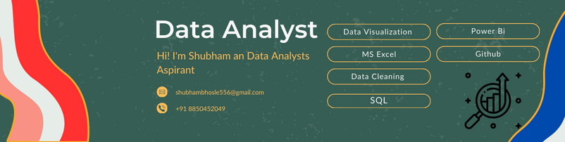

<h1 align="center">
 
</h1>
<h1 align="center">Hi 👋, I'm Shubham Bhosale</h1>
<h3 align="center">A passionate Python Programmer & data Analyst</h3>

  

  

- 🔭 I’m currently working on **Excel Project**

- 👯 I’m looking to work in **MNCs , Tech Startups**

- 👨‍💻 All of my projects are available at [https://github.com/shubhamBhosale0264](https://github.com/shubhamBhosale0264)

- 💬 Ask me about **Excel,Visualization, SQL**

- 📫 How to reach me **shubhambhosle556@gmail.com**

<h3 align="left">Connect with me:</h3>

<h3 align="left">Languages and Tools:</h3>

   
   
   
   
  
  
  

&nbsp;

